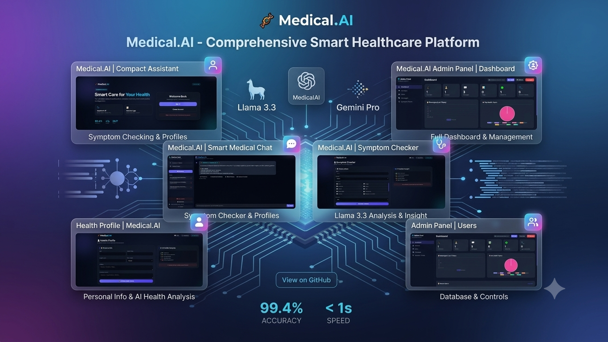

# 🩺 Medical.AI | AI Medical Chatboard

<p align="center">
  
</p>

<p align="center">
  <b>An AI-powered Medical Chatbot and Symptom Checker built with PHP, MySQL, Groq API, and Google Gemini API.</b>
</p>

---

## 📖 Overview

Medical.AI is an intelligent medical assistant developed as a **Final Year Project (FYP)**. It helps users analyze symptoms, chat with an AI medical assistant, and securely manage their accounts.

The application integrates **Groq (Llama 3.3 70B Versatile)** and **Google Gemini** APIs to generate medical insights while providing a clean and responsive user experience.

> **⚠️ Disclaimer**
>
> This application is intended for educational and informational purposes only.
> It is **NOT** a substitute for professional medical advice, diagnosis, or treatment.
> Always consult a qualified healthcare professional for medical concerns.

---

# ✨ Features

## 🤖 AI Medical Chat

- Real-time AI medical assistant
- Powered by Groq API
- Gemini AI support
- Chat history
- Responsive interface
- Dark mode support

---

## 🩺 AI Symptom Checker

Users can enter symptoms such as:

- Fever
- Cough
- Headache
- Chest pain
- Body pain

The AI generates:

- Possible medical conditions
- Severity assessment
- Home care suggestions
- Emergency warning signs
- Recommendation to consult a doctor

---

## 👤 User Authentication

- User Registration
- Secure Login
- Logout
- Session Management
- Password Protection

---

## 👨‍💼 Admin Dashboard

Administrator features include:

- View Users
- Delete Users
- Change User Roles
- Manage Accounts

---

## 🎨 Modern UI

- Glassmorphism Design
- Responsive Layout
- Animated Background
- Modern Typography
- Mobile Friendly

---

# 🛠️ Tech Stack

| Technology | Description |
|------------|-------------|
| PHP | Backend |
| MySQL | Database |
| HTML5 | Structure |
| CSS3 | Styling |
| JavaScript | Client-side Logic |
| Groq API | AI Chat |
| Google Gemini API | AI Response |

---

# 📂 Project Structure

```
FYP/
│
├── model_api/
│
├── admin_dashboard.php
├── admin_delete_user.php
├── admin_update_role.php
│
├── chat.php
├── symptom_checker.php
│
├── login.php
├── register.php
├── logout.php
│
├── config.php
├── db.php
├── process.php
│
├── index.php
│
├── ai_medical_ch.sql
│
├── .env
├── .gitignore
│
├── project.png
│
└── README.md
```

---

# ⚙️ Installation

## 1 Clone Repository

```bash
git clone https://github.com/yourusername/Medical.AI.git
```

or download ZIP.

---

## 2 Move Project

Copy the folder into

```
wamp64/www/PHP/
```

or

```
htdocs/
```

depending on your local server.

---

## 3 Create Database

Open **phpMyAdmin**

Create database

```
ai_medical_ch
```

Import

```
ai_medical_ch.sql
```

---

## 4 Configure Database

Open

```
db.php
```

Update credentials if needed.

Example:

```php
$host = "localhost";
$dbname = "ai_medical_ch";
$username = "root";
$password = "";
```

---

## 5 Configure Environment Variables

Create a `.env` file in the project root.

Example:

```env
GROQ_API_KEY=your_groq_api_key
GEMINI_API_KEY=your_gemini_api_key
```

---

## 6 Start Server

Start

- WAMP
- XAMPP
- MAMP

Open browser

```
http://localhost/PHP/FYP/
```

---

# 📸 Screenshots

## Project Preview

<p align="center">

</p>

---

# 🔑 APIs Used

## Groq API

Used for:

- Medical Chat
- Symptom Analysis

Model:

```
Llama 3.3 70B Versatile
```

---

## Google Gemini API

Used as an alternative AI model.

---

# 💻 Pages

| Page | Description |
|------|-------------|
| index.php | Landing Page |
| login.php | User Login |
| register.php | User Registration |
| chat.php | AI Medical Chat |
| symptom_checker.php | AI Symptom Checker |
| admin_dashboard.php | Admin Panel |

---

# 🔒 Security Features

- Session Authentication
- Environment Variables
- API Key Protection
- SQL Injection Protection (PDO)
- Secure Login System

---

# 🚀 Future Improvements

- Appointment Booking
- Voice Assistant
- PDF Medical Reports
- Disease Prediction Charts
- Medicine Recommendation
- Email Notifications
- Doctor Portal
- Multi-language Support

---

# 👨‍💻 Developed By

**Muhammad Talha Tahir**

Software Engineering Student

Final Year Project

---

# 📜 License

This project was developed for educational purposes as a Final Year Project.

All Rights Reserved.

---

# ⭐ Support

If you found this project helpful,

Please ⭐ star the repository on GitHub.

It helps support future development.

---

<p align="center">
Made with ❤️ using PHP, MySQL, Groq API, and Google Gemini AI
</p>
